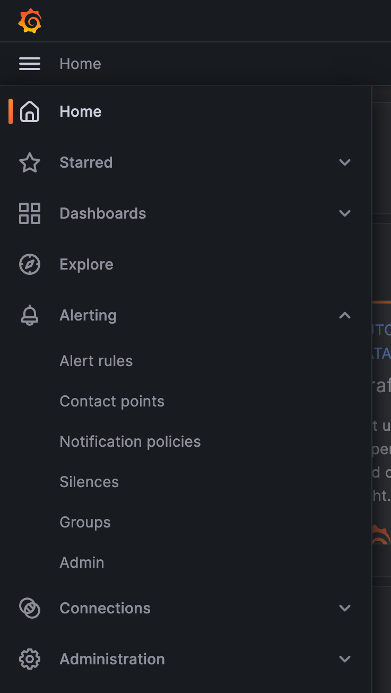
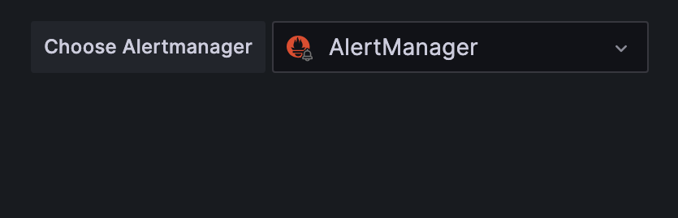

# Monitoring

## Creating silences

In order to create a silence, you'll need to login to your Grafana instance that
is deployed as part of Atmosphere as an admin user.

1. Click on the hamburger menu in the top left corner and select "Alerting"
   and then "Silences" from the menu.

   

2. Ensure that you select "AlertManager" on the top right corner of the page,
   this will make sure that you create a silence inside of the AlertManager
   that is managed by the Prometheus operator instead of the built-in Grafana
   AlertManager which is not used.

   

   !!! warning

   It's important that you select the AlertManager that is managed by the
   Prometheus operator, otherwise your silence will not be applied to the
   Prometheus instance that is deployed as part of Atmosphere.

3. Click the "Add Silence" button and use the AlertManager format to create
   your silence, which you can test by seeing if it matches any alerts in the
   list labeled "Affected alert instances".

!!! note

    It is strongly recommended that you create a silence with the least amount
    of needed labels which will make sure that small minor changes to the
    alerts will not break your silence.
