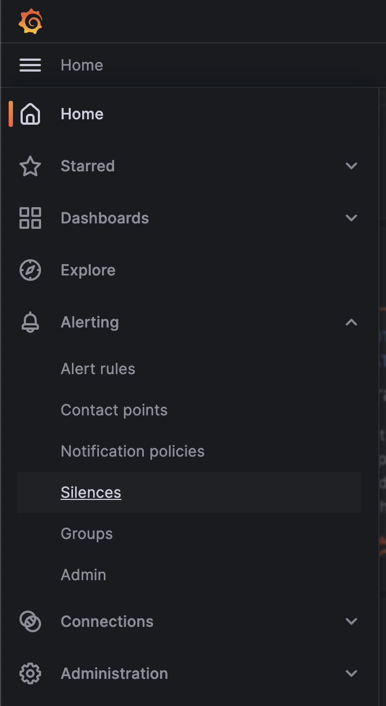
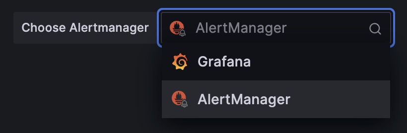

# Monitoring

## Creating silences

In order to create a silence, you'll need to login to your Grafana instance that
is deployed as part of Atmosphere as an admin user.

1. Click on the hamburger menu in the top left corner and select "Alerting"
   and then "Silences" from the menu.

   

2. Ensure that you select "AlertManager" on the top right corner of the page,
   this will make sure that you create a silence inside of the AlertManager
   that is managed by the Prometheus operator instead of the built-in Grafana
   AlertManager which is not used.

   

   !!! warning

   It's important that you select the AlertManager that is managed by the
   Prometheus operator, otherwise your silence will not be applied to the
   Prometheus instance that is deployed as part of Atmosphere.

3. Click the "Add Silence" button and use the AlertManager format to create
   your silence, which you can test by seeing if it matches any alerts in the
   list labeled "Affected alert instances".

!!! note

    It is strongly recommended that you create a silence with the least amount
    of needed labels which will make sure that small minor changes to the
    alerts will not break your silence.

## Persistence

For Grafana, rather than enabling persistence through the application's user
interface or manual Helm chart modifications, dashboards should be managed
directly via the Helm chart values.

!!! warning

    It is important to avoid manual persistence configurations, especially for
    services like Grafana, where dashboards and data sources can be saved. Such
    practices are not captured in version control and pose a risk of data loss,
    configuration drift, and upgrade complications.

To manage Grafana dashboards through Helm, you can include the dashboard
definitions within your configuration file. By doing so, you facilitate
version-controlled dashboard configurations that can be replicated across
different deployments without manual intervention.

For example, a dashboard can be defined in the Helm values like this:

```yaml
kube_prometheus_stack_helm_values:
  grafana:
    dashboards:
      default:
        my-dashboard:
          gnetId: 10000
          revision: 1
          datasource: Prometheus
```

This instructs Helm to fetch and configure the specified dashboard from
[Grafana.com](https://grafana.com/grafana/dashboards/), using Prometheus as the data source.

You can find more examples of how to do this in the Grafana Helm chart
[Documentation](https://github.com/grafana/helm-charts/tree/main/charts/grafana#import-dashboards).

## Alert receiver integration

To receive monitoring alerts using your preferred notification tools, you'll
need to integrate them with alertmanager.

### Email

To integrate with email, configure your email server and credentials in
alertmanager receivers like this.

```yaml
kube_prometheus_stack_helm_values:
  alertmanager:
    config:
      route:
        routes:
          - receiver: "email"
            matchers: ["severity =~ \"warning|critical\""]
      receivers:
        - name: "email"
          email_configs:
            - smarthost: 'smtp.gmail.com:587'
              auth_username: '<your email id here>'
              auth_password: '<your email password here>'
              from: '<your email id here>'
              to: '<receiver's email id here>'
              headers:
                subject: 'Prometheus Mail Alerts'
```

You can find more details about `email_configs` from [this](https://prometheus.io/docs/alerting/latest/configuration/#email_config).

### Pagerduty

- In Pagerduty

To integrate with Pagerduty, first you need to prepare `Integration key` in
Pagerduty.

There are two ways to integrate with PagerDuty: via [Event Orchestration](https://support.pagerduty.com/docs/event-orchestration)
or directly through an [Integration on a PagerDuty service](https://support.pagerduty.com/docs/services-and-integrations#section-configuring-services-and-integrations).

Integrating with Event Orchestration may be beneficial if you want to build
different routing rules based on the events coming from the integrated tool.

Integrating with a PagerDuty service directly can be beneficial if you
don't need to route alerts from the integrated tool to different responders
based on the event payload.

You can find how to generate `Integration key` using both ways in this
[Document](https://www.pagerduty.com/docs/guides/prometheus-integration-guide/).

- In Atmoshpere

Configure your `Integration key` in alertmanager receivers like this.

```yaml
kube_prometheus_stack_helm_values:
  alertmanager:
    config:
      route:
        routes:
          - receiver: "pagerduty"
            matchers: ["severity =~ \"warning|critical\""]
      receivers:
        - name: "pagerduty"
          pagerduty_configs:
            - service_key: '<your integration key here>'
```

You can find more details about `pagerduty_configs` from [this](https://prometheus.io/docs/alerting/latest/configuration/#pagerduty_config).
